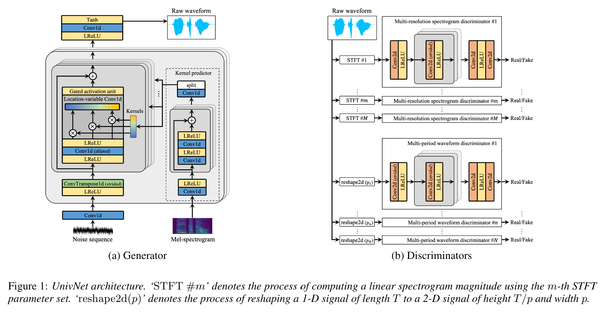
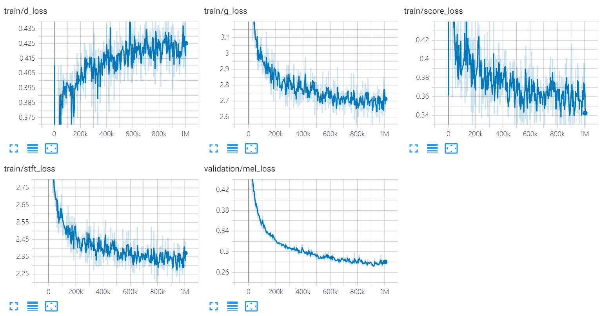

# UnivNet
**UnivNet: A Neural Vocoder with Multi-Resolution Spectrogram Discriminators for High-Fidelity Waveform Generation**

This is an unofficial PyTorch implementation of ***Jang et al.* (Kakao), [UnivNet](https://arxiv.org/abs/2106.07889)**.

Audio samples are uploaded!

[](https://arxiv.org/abs/2106.07889) [](https://mindslab-ai.github.io/univnet/) [](./LICENSE)

## Notes

**Both UnivNet-c16 and c32 results and the pre-trained weights have been uploaded.**

**For both models, our implementation matches the objective scores (PESQ and RMSE) of the original paper.**

## Key Features



- According to the authors of the paper, UnivNet obtained the best objective results among the recent GAN-based neural vocoders (including HiFi-GAN) as well as outperforming HiFi-GAN in a subjective evaluation. Also its inference speed is 1.5 times faster than HiFi-GAN.

- This repository uses the same mel-spectrogram function as the [Official HiFi-GAN](https://github.com/jik876/hifi-gan), which is compatible with [NVIDIA/tacotron2](https://github.com/NVIDIA/tacotron2).

- Our default mel calculation hyperparameters are as below, following the original paper.

  ```yaml
  audio:
    n_mel_channels: 100
    filter_length: 1024
    hop_length: 256 # WARNING: this can't be changed.
    win_length: 1024
    sampling_rate: 24000
    mel_fmin: 0.0
    mel_fmax: 12000.0
  ```

  You can modify the hyperparameters to be compatible with your acoustic model.

## Prerequisites

The implementation needs following dependencies.

0. Python 3.6
1. [PyTorch](https://pytorch.org/) 1.6.0
2. [NumPy](https://numpy.org/) 1.17.4 and [SciPy](https://www.scipy.org/) 1.5.4
3. Install other dependencies in [requirements.txt](./requirements.txt).
    ```bash
    pip install -r requirements.txt
    ```

## Datasets

**Preparing Data**

- Download the training dataset. This can be any wav file with sampling rate 24,000Hz. The original paper used LibriTTS.
  - LibriTTS train-clean-360 split [tar.gz link](https://www.openslr.org/resources/60/train-clean-360.tar.gz)
  - Unzip and place its contents under `datasets/LibriTTS/train-clean-360`.
- If you want to use wav files with a different sampling rate, please edit the configuration file (see below).

Note: The mel-spectrograms calculated from audio file will be saved as `**.mel` at first, and then loaded from disk afterwards.

**Preparing Metadata**

Following the format from [NVIDIA/tacotron2](https://github.com/NVIDIA/tacotron2), the metadata should be formatted as:
```
path_to_wav|transcript|speaker_id
path_to_wav|transcript|speaker_id
...
```

Train/validation metadata for LibriTTS train-clean-360 split and are already prepared in `datasets/metadata`.
5% of the train-clean-360 utterances were randomly sampled for validation.

Since this model is a vocoder, the transcripts are **NOT** used during training.  

## Train

**Preparing Configuration Files**

- Run `cp config/default_c32.yaml config/config.yaml` and then edit `config.yaml`

- Write down the root path of train/validation in the `data` section. The data loader parses list of files within the path recursively.
  
  ```yaml
  data:
    train_dir: 'datasets/'	# root path of train data (either relative/absoulte path is ok)
    train_meta: 'metadata/libritts_train_clean_360_train.txt'	# relative path of metadata file from train_dir
    val_dir: 'datasets/'		# root path of validation data
    val_meta: 'metadata/libritts_train_clean_360_val.txt'		# relative path of metadata file from val_dir
  ```
  
  We provide the default metadata for LibriTTS train-clean-360 split.
  
- Modify `channel_size` in `gen` to switch between UnivNet-c16 and c32.
  
  ```yaml
  gen:
    noise_dim: 64
    channel_size: 32 # 32 or 16
    dilations: [1, 3, 9, 27]
    strides: [8, 8, 4]
    lReLU_slope: 0.2
  ```

**Training**

```bash
python trainer.py -c CONFIG_YAML_FILE -n NAME_OF_THE_RUN
```

**Tensorboard**

```bash
tensorboard --logdir logs/
```

If you are running tensorboard on a remote machine, you can open the tensorboard page by adding `--bind_all` option.

## Inference

```bash
python inference.py -p CHECKPOINT_PATH -i INPUT_MEL_PATH -o OUTPUT_WAV_PATH
```

## Pre-trained Model

You can download the pre-trained models from the Google Drive link below. The models were trained on LibriTTS train-clean-360 split.
- **UnivNet-c16: [Google Drive](https://drive.google.com/file/d/1Iqw9T0rRklLsg-6aayNk6NlsLVHfuftv/view?usp=sharing)**
- **UnivNet-c32: [Google Drive](https://drive.google.com/file/d/1QZFprpvYEhLWCDF90gSl6Dpn0gonS_Rv/view?usp=sharing)**

## Results

See audio samples at https://mindslab-ai.github.io/univnet/

We evaluated our model with validation set.

| Model                | PESQ(↑)   | RMSE(↓)   | Model Size |
| -------------------- | --------- | --------- | ---------- |
| HiFi-GAN v1          | 3.54      | 0.423     | 14.01M     |
| Official UnivNet-c16 | 3.59      | 0.337     | 4.00M      |
| **Our UnivNet-c16**  | **3.60**  | **0.317** | **4.00M**  |
| Official UnivNet-c32 | 3.70      | 0.316     | 14.86M     |
| **Our UnivNet-c32**  | **3.68**  | **0.304** | **14.87M** |

The loss graphs of UnivNet are listed below.

The orange and blue graphs indicate c16 and c32, respectively.



## Implementation Authors

Implementation authors are:

- [Kang-wook Kim](http://github.com/wookladin) @ [MINDsLab Inc.](https://maum.ai/) (<a href="mailto:full324@snu.ac.kr">full324@snu.ac.kr</a>, <a href="mailto:kwkim@mindslab.ai">kwkim@mindslab.ai</a>)
- [Wonbin Jung](https://github.com/Wonbin-Jung) @ [MINDsLab Inc.](https://maum.ai/) (<a href="mailto:santabin@kaist.ac.kr">santabin@kaist.ac.kr</a>, <a href="mailto:wbjung@mindslab.ai">wbjung@mindslab.ai</a>)

Contributors are:

- [Kuan Chen](https://github.com/azraelkuan)

Special thanks to

- [Seungu Han](https://github.com/Seungwoo0326) @ [MINDsLab Inc.](https://maum.ai/)
- [Junhyeok Lee](https://github.com/junjun3518) @ [MINDsLab Inc.](https://maum.ai/)
- [Sang Hoon Woo](https://github.com/tonyswoo) @ [MINDsLab Inc.](https://maum.ai/)

## License

This code is licensed under BSD 3-Clause License.

We referred following codes and repositories.

- The overall structure of the repository is based on [https://github.com/seungwonpark/melgan](https://github.com/seungwonpark/melgan).
- [datasets/dataloader.py](./datasets/dataloader.py) from https://github.com/NVIDIA/waveglow (BSD 3-Clause License)
- [model/mpd.py](./model/mpd.py) from https://github.com/jik876/hifi-gan (MIT License)
- [model/lvcnet.py](./model/lvcnet.py) from https://github.com/zceng/LVCNet (Apache License 2.0)
- [utils/stft_loss.py](./utils/stft_loss.py) # Copyright 2019 Tomoki Hayashi #  MIT License (https://opensource.org/licenses/MIT)

## References

Papers

- *Jang et al.*, [UnivNet: A Neural Vocoder with Multi-Resolution Spectrogram Discriminators for High-Fidelity Waveform Generation](https://arxiv.org/abs/2106.07889)
- *Zeng et al.*, [LVCNet: Efficient Condition-Dependent Modeling Network for Waveform Generation](https://arxiv.org/abs/2102.10815)
- *Kong et al.*, [HiFi-GAN: Generative Adversarial Networks for Efficient and High Fidelity Speech Synthesis](https://arxiv.org/abs/2010.05646)

Datasets

- [LibriTTS](https://openslr.org/60/)
